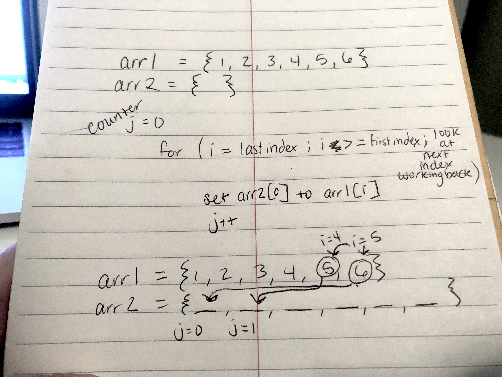

# data-structures-and-algorithms

### This repo is created to hold the code challenges for 401 course and to be used as a reference

## Table of contents:

CD # | Topic / Link | image
---------|------------- |-----------
CD 1 | [array-reverse](https://github.com/Hisham-401-advanced-javascript/data-structures-and-algorithms/blob/master/challenges/arrayReverse/array-reverse.js) | 