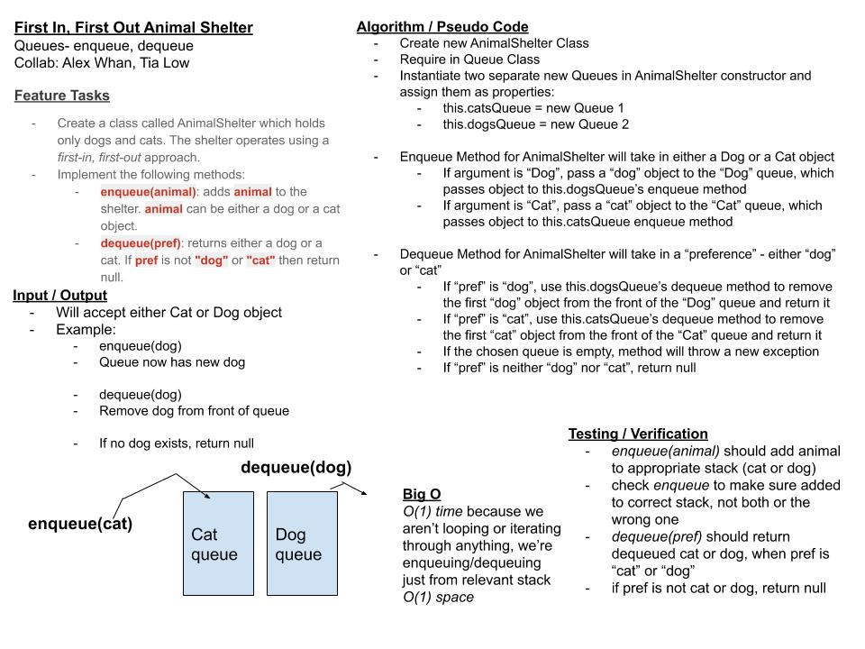

# First-In/First-Out Animal Shelter

## Challenge

Create a class called `AnimalShelter` which holds only dogs and cats. The shelter operates using a first-in, first-out approach.

Implement the following methods:

- `enqueue(animal)`: adds animal to the shelter. animal can be either a dog or a cat object.

- `dequeue(pref)`: returns either a dog or a cat. If pref is not "dog" or "cat" then return `null`.

#### Also has access to Queue class methods:

- `enqueue(value)`: Takes any value as an argument and adds a new node with that value to the back of the queue with an O(1) Time performance.

- `dequeue()`: Does not take any argument, removes the node from the front of the queue, and returns the node’s value. Raises an exception when called on an empty queue.

- `peek()`: Does not take an argument and returns the value of the node located in the front of the queue, without removing it from the queue. Raises an exception when called on an empty queue.

- `isEmpty()`: Takes no argument, and returns a boolean indicating whether or not the queue is empty.

## Approach & Efficiency

### Big O Time:

O(1)

- No loops or iterations - only simple `enqueue` and `dequeue` methods that feed into the `enqueue` and `dequeue` methods of the `Queue` class.

### Big O Space:

O(1)

- Two instantiations of `Queue` class

## Diagrams & Solutions

### Whiteboard

